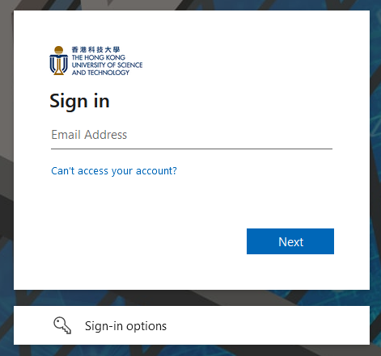
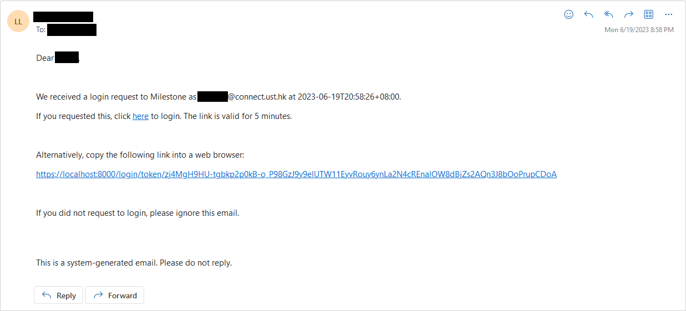

# Login

A user can log into Milestone with two methods:

- [Login with AAD](#login-with-aad)
- [Open a login link in email](#open-a-login-link-in-email)

## Login with AAD

On the login page, click the "Login with Azure Active Directory" button and you will be required to log in your ITSC email on Microsoft.

::: tip
If you have logged in your ITSC email on other websites, you will be redirected to the admin home page after clicking the "Login with Azure Active Directory" button.
:::

## Open a login link in email

On the login page, click the "Login with email instead" button. Type your ITSC email and then click the "Send" button.

A login email will be sent to your email shortly. By clicking the login link, you will be redirect to the admin home page.

