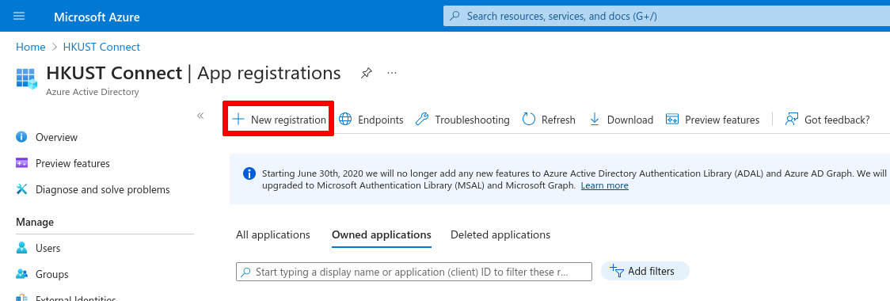
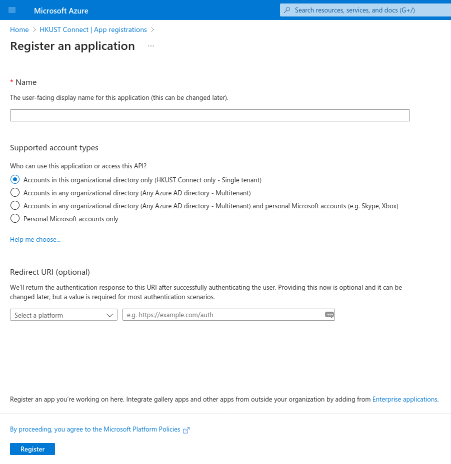
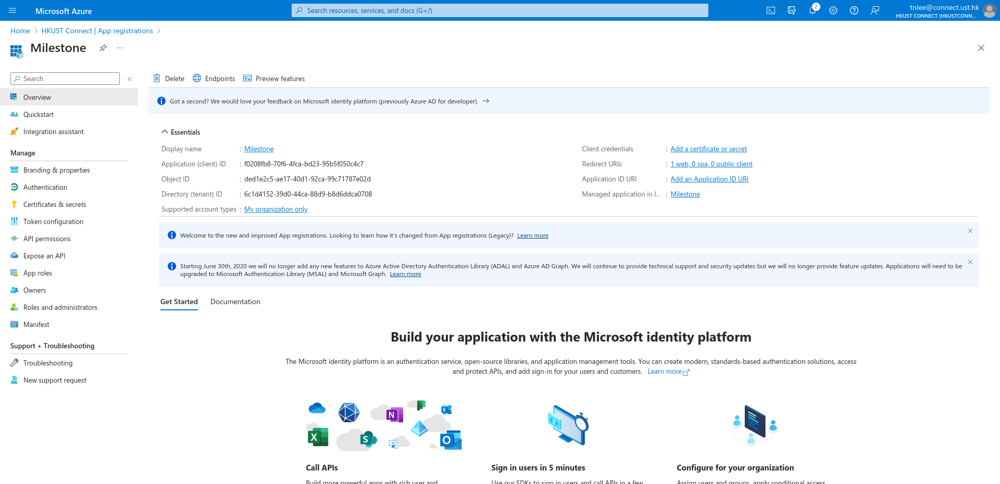
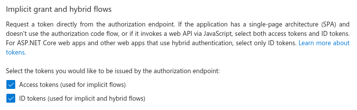
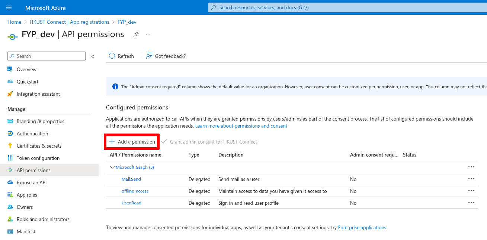
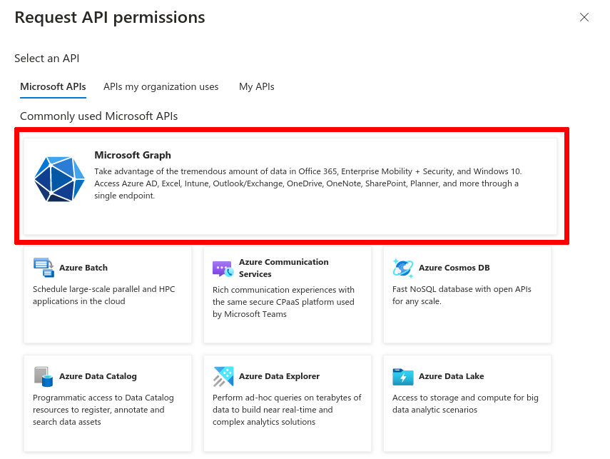
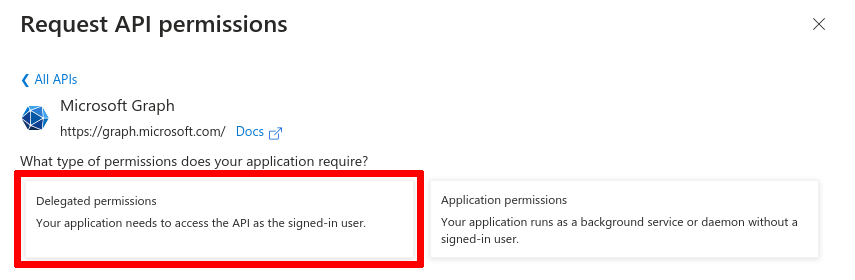
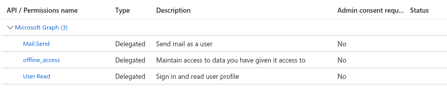
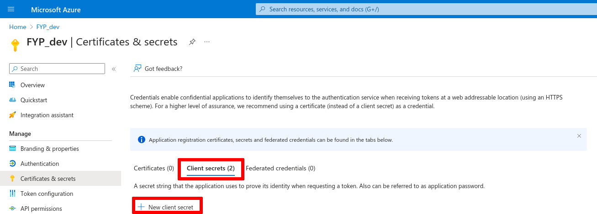
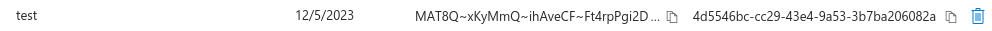

# Azure Active Directory setup

This guide will lead you through the creation of an Azure AD app registration, so that the application can leverage Azure AD features, and access other users' accounts or perform actions on their behalf.

## Step 1. New app registration

Go to the [Azure AD app registrations page](https://portal.azure.com/#view/Microsoft_AAD_IAM/ActiveDirectoryMenuBlade/~/RegisteredApps) on Azure Portal. Login with your Microsoft account if needed.

::: details If link does not work
Navigate to [Azure portal](https://portal.azure.com) then search for and click on "Azure Active Directory". Next, from the left sidebar, find and click on "App registrations".
:::

Click on the "New registration" button.

On the next page, enter a meaningful name for the "Name" field, then choose "Accounts in this organizational directory only (Single tenant)" for the account types. In the "Redirect URI" field, select "Web" and enter the URI according to the purpose of the registration.

Refer to the table below for the correct redirect URIs (replace `example.com` with the appropriate hostname, also note the use of `https://`).

| Purpose | URI |
| ------- | --- |
| Sending emails | `https://example.com/msgraph/oauth` |
| Authenticating users | `https://example.com/login/oauth/aad/callback` |

After completing the form, click "Register". You should be redirected to a page that looks like this:

## Step 2. Configure AAD app

### Step 2.1. Enable access and ID tokens

::: tip
This step is only necessary if the Azure AD registration is used for authenticating users. For sending emails, you may skip this step and go to [step 2.2](#step-22-configure-api-permissions).
:::

From the app registration's page, select "Authentication" from the side bar. Scroll down and find "Implicit grant and hybrid flows".

Select to enable both checkboxes under this section.

### Step 2.2. Configure API permissions

From the sidebar, find and click "API permissions".

On the API permissions page, click "Add a permission".

Then, from the panel, first click "Microsoft Graph", then "Delegated permissions".

Next, search for the desired permissions in the search bar and select the appropriate checkboxes. Refer to the table below for the correct permissions to enable.

| Purpose | Permissions |
| ------- | --- |
| Sending emails | `Mail.Send`, `User.Read`, `offline_access` |
| Authenticating users | `openid` |

When you are done, click "Add permissions".

Verify that the correct permissions were enabled.

::: tip
If the app is for authenticating users, you may remove all the other redundant permissions (e.g. `User.Read`).
:::

## Step 3. Creating tokens

Next, tokens (secrets) have to be obtained for the application to access the API.

From the sidebar, select "Certificates & secrets". On the secrets page, navigate to the "Client secrets" tab and click "New client secret".

Then, enter a descriptive name and select a suitable expiry period. After that, click "Add".

A new row will be added to the table, with the secret values uncovered.

::: warning
Be sure to copy the secret value NOW because it will not be shown again.
:::

Now, copy the secret value (first) and the other parameters to the `.env` files. The table below shows which value corresponds to which environmental variable.

| Environmental variable (emails / authentication) | Azure portal | Obtained from |
| ---------------------- | ------------ | ------------- |
| `GRAPH_TENANT_ID` / `AUTH_AAD_TENANT_ID` | Directory (tenant) ID | The "Overview" page of a registered app |
| `GRAPH_APP_ID` / `AUTH_AAD_APP_ID` | Application (client) ID | The "Overview" page of a registered app |
| `GRAPH_APP_SECRET_ID` / `AUTH_AAD_APP_SECRET_ID` | Secret ID | The "Certificates & secrets" page of a registered app |
| `GRAPH_APP_SECRET` / `AUTH_AAD_APP_SECRET` | Secret value | The "Certificates & secrets" page of a registered app |
| `GRAPH_CALLBACK_URL` / `AUTH_AAD_CALLBACK_URL` | Redirect URIs (one of them) | The "Authentication" page of a registered app |